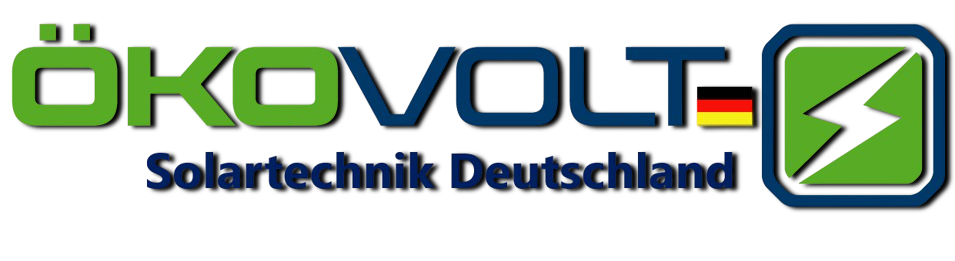

  

☀️ Oekovolt Solartechnik GmbH – Developer Branch

Welcome to the developer branch of the official website developed by IT Engineers for Oekovolt Solartechnik GmbH.

This branch serves as the main environment for developing, testing, and validating new features. Once functionality is approved, changes are merged into the main branch for production deployment.

📌 Project Overview

This project is a modern solar company platform with an optimized and scalable architecture, integrating a high-performance frontend with a robust PvOne backend system.

Frontend: Next.js (App Router, JavaScript, Tailwind CSS)

Backend: PvOne

🛠️ Tech Stack

Frontend

Framework: Next.js – App Router

Language: JavaScript

Styling: Tailwind CSS

Folder Structure:

src/
  ├── app/              → Application routing and pages
  ├── components/       → Reusable UI and logic components
public/                 → Static assets and SVGs

Backend

PvOne

PvOne Framework

🚀 Getting Started (Frontend)

✅ Prerequisites

Node.js v18+

npm or Yarn

📦 Installation

Clone the repository:

git clone http://46.99.162.142:3000/IT-Engineers-LLC/OekovoltDe-Web.git --branch develop
cd OekovoltDe-Web

Install dependencies:

npm install
# or
yarn install

npm run dev
# or
yarn dev

Access the frontend:

Open your browser and visit: http://localhost:3000

🧱 Getting Started (Backend – PvOne)

The backend uses the PvOne Framework with customizations under the PvOne application.

📌 Backend Prerequisites

Python 3.10+

Node.js & Yarn

Redis

MariaDB 10.6+

wkhtmltopdf (with patched Qt)

PvOne Framework Bench CLI

📅 Backend Setup

ℹ️ We have created a custom shell script that automatically installs and configures PvOne Framework for you.

To start the backend server:

Connect to the server using PuTTY or terminal.

Navigate to the bench directory:

cd /path/to/oekovolt-backend

Start the server:

bench start

Access the PvOne backend:http://ip-address:8000

💼 Directory Highlights

src/app/ – All route-based pages (/agb, /kontakt, /referenzen, etc.)

src/components/ – Modular components by feature (e.g., Navbar, Jobs, Project, etc.)

public/ – Static assets such as logos and SVG icons

globals.css – Global Tailwind and custom styles

layout.js – Root layout wrapper

page.js – Homepage route

🔀 Development Workflow

Work on a new branch from develop.

Implement and test your features.

Commit with meaningful messages.

Push to the remote develop branch.

📄 License

This software is proprietary and was developed by IT Engineers for Oekovolt Solartechnik GmbH.

📢 Contact

IT Engineers LLC 📧 Email: office@it-bedarf.at 🌐 Website: https://www.itengineers.at

© 2025 IT Engineers – All Rights Reserved